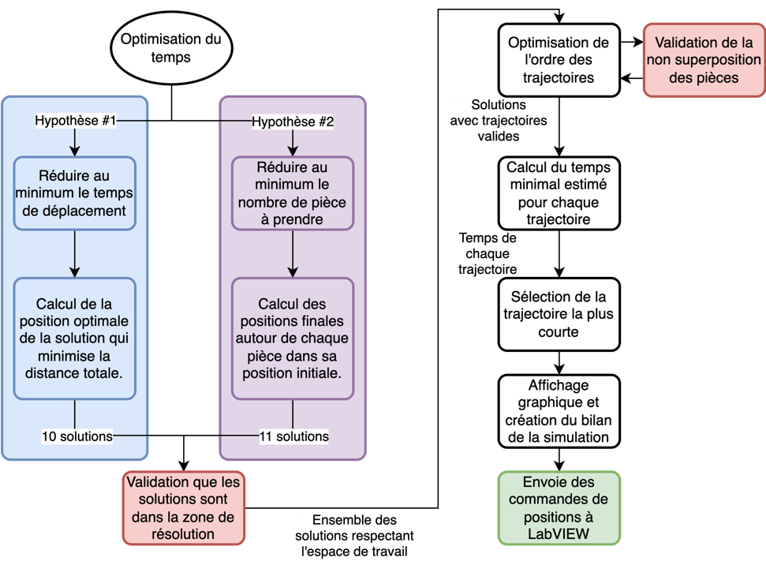

# Optimisation 

Ce code a été développé dans le cadre du cours Investigation (GMC-3013) pour la station de triage. 

Concrètement, le but du code est de déterminé l'endroit et la trajectoire qui permet de résoudre un casse tête géométrique à l'aide d'un robot sériel de type portique le plus rapidement possible
Les intrants sont les positions (x,y,theta) de chaque pièce et les extrants sont l'ensemble des positions que doit parcourir l'effecteur pour résoudre le casse-tête le plus rapidement possible. 
Les intrants et les extrants sont sous forme de .CSV, car ce code est appelé par un autre code LABVIEW. 

Les hypothèses utilisées pour trouver la solution la plus rapide sont les suivantes :
1.	Les déplacements en x, y et thêta sont ceux prenant le plus de temps. Il serait donc crucial d’en réduire le plus possible leur distance à parcourir.
2.	Les déplacements en z pour la prise et le dépôt des pièces sont les plus lents. Il est donc crucial d’en limiter le nombre.

Ces deux hypothèses tendent chacune vers une méthode d’optimisation distincte.
1.	Les déplacements horizontaux (x, y, thêta) étant significatifs, il faut minimiser ceux-ci. Pour ce faire, on cherche à minimiser la somme de tous les déplacements horizontaux nécessaire pour former la solution finale.
2.	Puisqu’on cherche à minimiser la prise de pièces, certaines pièces ne pourront pas être déplacées. En réalité, considérant le placement initial aléatoire des pièces, il n’y a qu’une seule pièce qui peut ne pas être déplacée. C’est autour de cette pièce qu’on peut construire notre solution.
Ces deux méthodes permettent chacune de générer une ou plusieurs matrices de solution. Les étapes de l’algorithme d’optimisation sont représentées à la figure 1.
 

 
Figure 1: Représentation schématique des principales étapes de l'optimisation en temps des trajectoires.

L’algorithme d’optimisation des trajectoires débute en générant les solutions possibles basées sur les deux hypothèses précédemment expliquées. L’ensemble de ces solutions sont analysées afin de vérifier que chacune des positions finales des pièces soit entièrement dans la zone de résolution, soit la zone de vision. Les solutions dans ce domaine sont alors passées dans un algorithme qui optimise l’ordre des pièces à aller chercher et ressort les trajectoires de chacune de ces solutions. Le temps minimal pour que l’effecteur réalise chacune des trajectoires est ensuite estimé à partir de courbes d’étalonnage. Le temps de chaque solution est comparé afin de déterminer la meilleure solution qui est ensuite sauvegardée et envoyée à la partie du programme LabVIEW qui peut lire et exécuter l’ensemble des positions. Finalement, les données d’optimisation sont sauvegardées et l’affichage graphique est lancé si celui-ci est activé. Il n’est pas activé dans la version finale du code, car l’interface graphique ralentirait la résolution du Tangram sans ajouter un bénéfice. L’affichage graphique est une réplique de la station de triage qui permet de représenter le déplacement des pièces et de l’effecteur du robot. 

Pour plus de détails sur les différentes parties du code, se référer à la section 1.3 du rapport final de la station de triage. 